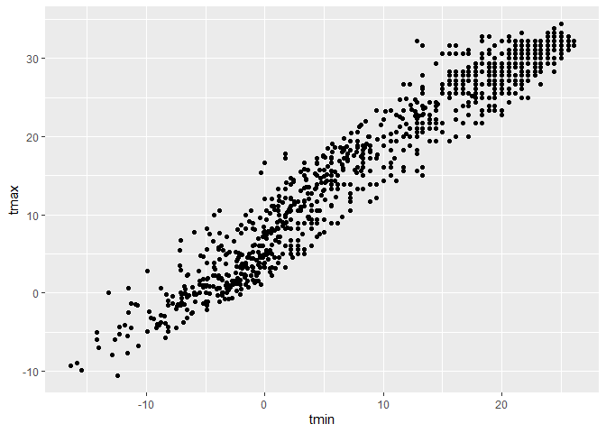
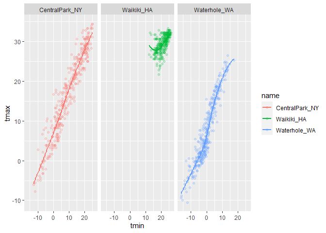
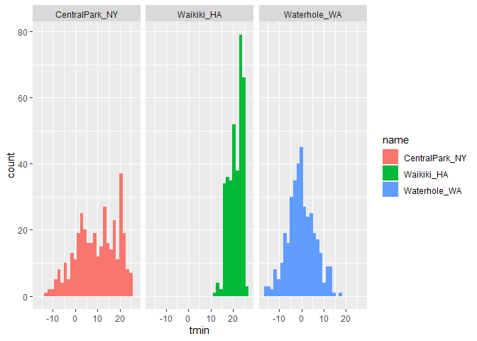
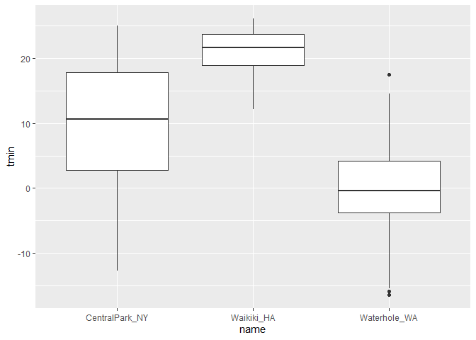

Visualization and EDA
================
Yiyao LI

``` r
library(tidyverse)
```

    ## -- Attaching packages ---------------- tidyverse 1.3.0 --

    ## √ ggplot2 3.3.2     √ purrr   0.3.4
    ## √ tibble  3.0.3     √ dplyr   1.0.2
    ## √ tidyr   1.1.2     √ stringr 1.4.0
    ## √ readr   1.3.1     √ forcats 0.5.0

    ## -- Conflicts ------------------- tidyverse_conflicts() --
    ## x dplyr::filter() masks stats::filter()
    ## x dplyr::lag()    masks stats::lag()

``` r
library(ggridges)
```

## load the weather data

``` r
weather_df = 
  rnoaa::meteo_pull_monitors(
    c("USW00094728", "USC00519397", "USS0023B17S"),
    var = c("PRCP", "TMIN", "TMAX"), 
    date_min = "2017-01-01",
    date_max = "2017-12-31") %>%
  mutate(
    name = recode(
      id, 
      USW00094728 = "CentralPark_NY", 
      USC00519397 = "Waikiki_HA",
      USS0023B17S = "Waterhole_WA"),
    tmin = tmin / 10,
    tmax = tmax / 10) %>%
  select(name, id, everything())
```

    ## Registered S3 method overwritten by 'hoardr':
    ##   method           from
    ##   print.cache_info httr

    ## using cached file: C:\Users\liyy9916\AppData\Local\Cache/R/noaa_ghcnd/USW00094728.dly

    ## date created (size, mb): 2020-10-06 11:19:50 (7.537)

    ## file min/max dates: 1869-01-01 / 2020-10-31

    ## using cached file: C:\Users\liyy9916\AppData\Local\Cache/R/noaa_ghcnd/USC00519397.dly

    ## date created (size, mb): 2020-10-06 11:20:08 (1.703)

    ## file min/max dates: 1965-01-01 / 2020-03-31

    ## using cached file: C:\Users\liyy9916\AppData\Local\Cache/R/noaa_ghcnd/USS0023B17S.dly

    ## date created (size, mb): 2020-10-06 11:20:17 (0.882)

    ## file min/max dates: 1999-09-01 / 2020-10-31

## Scatter plots

creat my first scatterplot ever.

``` r
ggplot(weather_df, aes(x = tmin, y = tmax)) + 
  geom_point()
```

<!-- -->

New approach, same plot.

``` r
weather_df %>%
  ggplot(aes(x = tmin, y = tmax)) + 
  geom_point()
```

<!-- -->

Save and edit a plot project.

``` r
weather_plot = 
  weather_df %>%
  ggplot(aes(x = tmin, y = tmax))

weather_plot + geom_point()
```

<!-- -->

## Advanced scatter plot

Start with the same one and make it fancy

``` r
weather_df %>%
  ggplot(aes(x = tmin, y = tmax, color = name)) + 
  geom_point() + 
  geom_smooth(se = FALSE)
```

    ## `geom_smooth()` using method = 'loess' and formula 'y ~ x'

<!-- -->

What about the ‘aes’ placement?

``` r
weather_df %>%
  ggplot(aes(x = tmin, y = tmax, color = name)) + 
  geom_point(alpha = .2) + 
  geom_smooth(se = FALSE) +
  facet_grid(. ~ name)
```

    ## `geom_smooth()` using method = 'loess' and formula 'y ~ x'

<!-- -->

combine some elements and form a new plot

``` r
weather_df %>%
  ggplot(aes(x = date, y = tmax, color = name)) + 
  geom_point(aes(size = prcp), alpha = .5) + 
  geom_smooth(se = FALSE) +
  facet_grid(. ~ name)
```

    ## `geom_smooth()` using method = 'loess' and formula 'y ~ x'

<!-- -->

How many geoms have to exist?

you can have whatever geoms you want

``` r
weather_df %>%
  ggplot(aes(x = tmin, y = tmax, color = name)) + 
  geom_smooth(se = FALSE)
```

    ## `geom_smooth()` using method = 'loess' and formula 'y ~ x'

<!-- -->

you can use a neat geom.

``` r
weather_df %>%
  ggplot(aes(x = tmin, y = tmax)) + 
  geom_density2d() + 
  geom_point(alpha = .3)
```

<!-- -->

## Univeriate plot

histogram is really great

``` r
weather_df %>%
  ggplot(aes(x = tmin)) +
  geom_histogram()
```

    ## `stat_bin()` using `bins = 30`. Pick better value with `binwidth`.

<!-- -->

add color

``` r
weather_df %>%
  ggplot(aes(x = tmin, fill = name)) +
  geom_histogram() + 
  facet_grid(. ~ name)
```

    ## `stat_bin()` using `bins = 30`. Pick better value with `binwidth`.

<!-- -->

try a new histogram

``` r
weather_df %>%
  ggplot(aes(x = tmin, fill = name)) +
  geom_density(alpha = .3, adjust = .5)
```

<!-- -->

box plots

``` r
weather_df %>%
  ggplot(aes(x = name, y = tmin)) + 
  geom_boxplot()
```

<!-- -->

Trend plot

``` r
weather_df %>%
  ggplot(aes(x = name, y = tmin, fill = name)) + 
  geom_violin(alpha = .5) +
  stat_summary(fun = "median")
```

<!-- -->

Ridge plot

``` r
weather_df %>%
  ggplot(aes(x = tmin, y = name)) + 
  geom_density_ridges()
```

    ## Picking joint bandwidth of 1.67

<!-- -->

save the plot

``` r
weather_plot = 
  weather_df %>%
  ggplot(aes(x = tmin, y = tmax, color = name)) +
  geom_point(alpha = .5)

ggsave("./result/weather_plot.pdf", weather_plot, width = 8, height = 5)
```

    ## Warning: Removed 15 rows containing missing values (geom_point).

What about embedding

``` r
weather_plot
```

<!-- -->

embed at different size

``` r
weather_plot
```

<!-- -->
